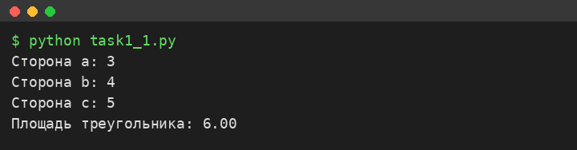
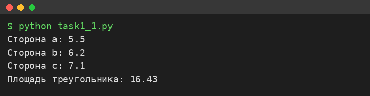
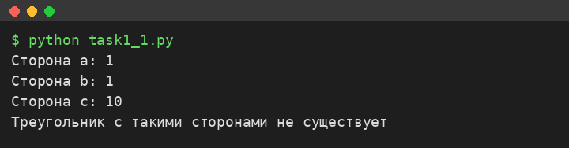
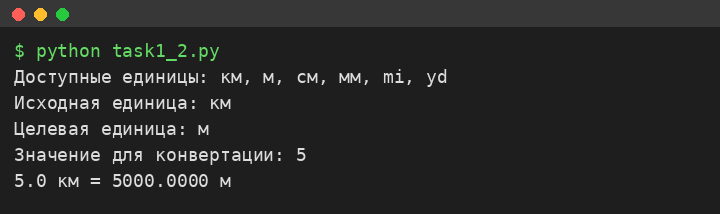
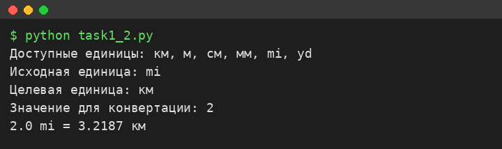
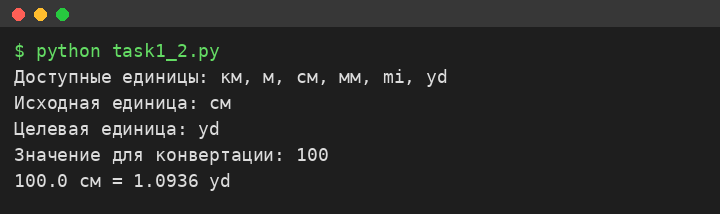
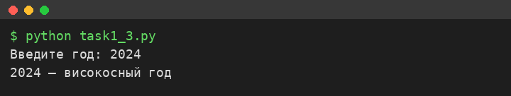
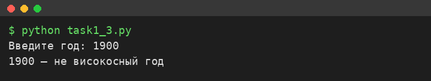
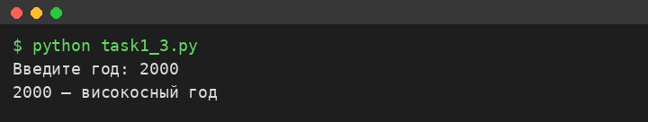

# Исполнитель
Малышкин Семен

Группа Фт-250008

# Лабораторная работа №1 — Функции ввода/вывода, условный оператор

Репозиторий содержит три задания лабораторной работы №1. Каждое задание
расположено в отдельной папке.

# Среда разработки

Язык программирования: Python 3.
Среда разработки: Visual Studio 2019.

Проекты можно открыть в Visual Studio или в любом редакторе (VS Code, PyCharm),
а также запустить напрямую из консоли командой `python`.

---

# Задание 1.1 — Калькулятор площади треугольника

**Формулировка задания:** написать программу, которая вычисляет площадь
треугольника по трём его сторонам по формуле Герона с точностью до сотых.
Пользователь вводит три числа (целых или дробных), результат выводится
с двумя знаками после запятой.

**Файл проекта:** `task1/task1_1.py`

**Как запускать и пользоваться:**

```
python task1_1.py
```

По запросу программы ввести три стороны треугольника. Программа выведет
площадь либо сообщение, что треугольник с такими сторонами не существует.

## Результаты тестирования

Тест 1 — стороны 3, 4, 5



Тест 2 — стороны 5.5, 6.2, 7.1



Тест 3 — некорректный треугольник (1, 1, 10)



---

# Задание 1.2 — Конвертер единиц измерения расстояния

**Формулировка задания:** создать программу-конвертер, которая переводит
расстояние из одних единиц измерения в другие. Поддерживаемые единицы:
километры (км), метры (м), сантиметры (см), миллиметры (мм), мили (mi),
ярды (yd).

**Файл проекта:** `task2/task1_2.py`

**Как запускать и пользоваться:**

```
python task1_2.py
```

Ввести исходную единицу измерения, затем целевую, после чего значение
для конвертации. Программа выведет результат перевода.

## Результаты тестирования

Тест 1 — 5 км в метры



Тест 2 — 2 мили в километры



Тест 3 — 100 см в ярды



---

# Задание 1.3 — Определение високосного года

**Формулировка задания:** написать программу, которая определяет, является ли
введённый год високосным. Год високосный, если делится на 4; но если делится
на 100 — не високосный; однако если делится на 400 — всё равно високосный.

**Файл проекта:** `task3/task1_3.py`

**Как запускать и пользоваться:**

```
python task1_3.py
```

Ввести год. Программа выведет, является ли он високосным.

## Результаты тестирования

Тест 1 — 2024 (високосный)



Тест 2 — 1900 (не високосный, делится на 100)



Тест 3 — 2000 (високосный, делится на 400)


